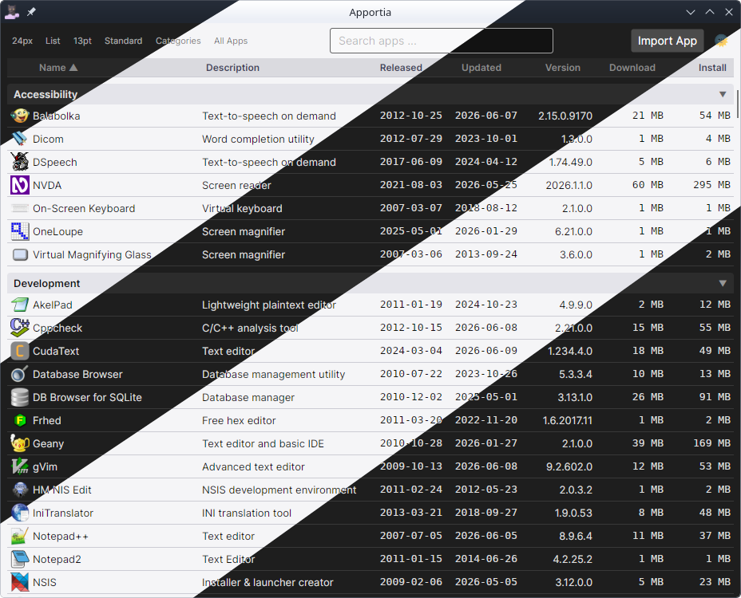

# Apportia

<p align="center">


<a href="LICENSE.txt"></a>
</p>
<p align="center">
<a href="../../actions/workflows/build.yaml"></a>
<a href="../../issues"></a>
<a href="../../commits/main"></a>
<a href="../../releases/latest"></a>
</p>

**Apportia** is a cross-platform manager for portable Windows applications. It lets you browse, install, and launch thousands of portable apps on both Windows and Linux — with Wine handling execution on Linux transparently.

> Apportia derives from *apport* — to bring forth — with a nod to *aporia*, the philosophical state of contradiction. Because that's exactly what portable apps are: software that was never meant to be portable, forced into harmony.

---

## Preview
<p align="center"></p>

---

## Features

- Runs natively on Linux and Windows; portable apps are executed via Wine on Linux
- Browse and search the full [PortableApps.com](https://portableapps.com) catalogue — support for additional app sources planned
- Filter by category and subcategory; sort by name, version, release date, last update, disk usage, and more
- Apps install and update silently in the background — no wizards, no popups
- Passive update detection without interruptions
- Custom app import — select a local folder containing a portable app and fully integrate it: files are copied into the managed custom apps directory and the entry is registered like any catalogue app
- App data backup and restore — optionally back up and restore app data across uninstall and reinstall
- Actual disk usage per installed app — see exactly how much space each portable app occupies on your drive, sortable alongside all other columns
- CLI argument support — pass arguments to any app at launch via an interactive parameter editor
- File and folder picker integration for building argument lists
- Automatic Linux path conversion for Wine (e.g. `/home/user/file.txt` becomes `Z:\home\user\file.txt`)
- Configurable UI — switch between detailed list and compact tile view, adjust icon size, font size, and more; save and restore view configurations as presets
- Keyboard shortcuts — press `Ctrl+F` to jump to search instantly; hold `Ctrl` while clicking or confirming an app to install or launch without any dialogs, or to silently queue it for download
- App details dialog — inspect full metadata for any catalogue entry via context menu
- App preview images — view a screenshot of any app directly from the context menu
- Full [VirusTotal](https://www.virustotal.com/) integration — scan apps by hash or upload files directly; results are shown inline without leaving the app; a scan is automatically suggested when a downloaded file fails integrity verification

---

## Download

The latest release is available on the [Releases](https://github.com/Apportia/Apportia/releases/latest) page as a single ZIP archive — no installation required, just extract and run the executable — *Apportia.exe* on Windows, *Apportia* on Linux.

---

## Requirements

### Linux
- Any modern x64 Linux distribution
- [Wine](https://wine-hq.com/) or [Wine Staging](https://wine-staging.com/) installed and available on `PATH` (required to extract and run portable Windows apps)
- No .NET runtime required — ships as a self-contained single-file executable
- The `WINEPREFIX` environment variable is respected if set

### Windows
- Windows 10 or later (x64)
- No additional dependencies — ships as a self-contained single-file executable

---

## Building from Source

### Prerequisites

- [.NET 10 SDK](https://dotnet.microsoft.com/download)
- [NSIS](https://nsis.sourceforge.io/) (for building the Windows installer stub — `makensis` must be on `PATH`)

### Build

```bash
# Debug build (default)
./build.sh

# Release build
./build.sh Release
```

### Run directly (without full build)

```bash
cd src/Apportia
dotnet run
```