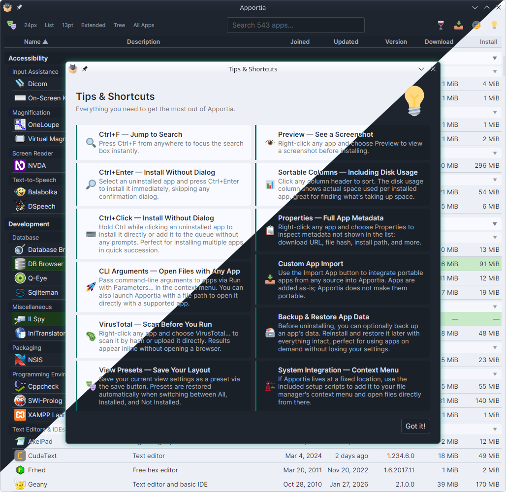

# Apportia

<p align="center">
<a href="https://dotnet.microsoft.com/download"></a>
<a href="https://learn.microsoft.com/dotnet/csharp/"></a>
<a href="https://avaloniaui.net/"></a>
<a href="https://distrochooser.de/"></a>
<a href="LICENSE.txt"></a>
</p>
<p align="center">
<a href="../../actions/workflows/build.yaml"></a>
<a href="../../issues"></a>
<a href="../../commits/main"></a>
<a href="../../releases/latest"></a>
</p>

**Apportia** is a cross-platform manager for portable Windows applications. It lets you browse, install, and launch thousands of portable apps on both Windows and Linux — with Wine handling execution on Linux transparently.

> Apportia derives from *apport* — to bring forth — with a nod to *aporia*, the philosophical state of contradiction. Because that's exactly what portable apps are: software that was never meant to be portable, forced into harmony.

---

## Preview
<p align="center"><a href="media/"></a></p>
<p align="center"><em><a href="media/">See more screenshots in the <b>media</b> folder</a></em></p>

---

## Features

- **Cross-platform**
    - Runs natively on Linux and Windows
    - Portable Windows apps execute transparently via Wine on Linux
    - Automatic Linux-to-Wine path conversion
        - *e.g. `/home/user/file.txt` becomes `Z:\home\user\file.txt`*
- **App sources**
    - Full **PortableApps.com** catalogue, browsable and searchable — more sources planned
    - Import apps directly from a GitHub repository, with releases tracked for automatic updates
    - Custom app import from a local folder — integrated like any catalogue app
    - Language variants — switch language packs on multi-language apps in a few clicks
    - Download mirror selection with automatic fallback if the primary mirror fails
- **Install and update**
    - One click to install or update; PAF setup routines run automatically in the background
        - Hold `Ctrl` while clicking to skip confirmation dialogs or silently queue an install
    - Available updates are shown discreetly and applied on demand — never enforced
    - Reinstall or uninstall any managed app in one click, including GitHub-imported custom apps
    - Apportia updates itself the same way
        - *with hash verification and a changelog preview before applying*
- **Safety**
    - Curated security advisories warn about apps with known issues — bundled adware, abandoned projects, or unpatched vulnerabilities — before you install
        - *a duty **PortableApps.com** neglects, so **Apportia** steps in*
    - Full **VirusTotal.com** integration — hash lookup or file upload, results inline
        - *requires a free [VirusTotal.com API key](https://docs.virustotal.com/docs/please-give-me-an-api-key)*
    - **VirusTotal.com** scan is auto-suggested when a download fails integrity verification
- **Data**
    - Backup and restore app data across uninstall and reinstall
    - Real disk usage per installed app — always visible and sortable like any other column
- **Interface**
    - Light and dark theme, following the system or manually selected
    - List or tile view with adjustable font size
        - Icon size adjustable from 12 to 256 px, fetched on demand
    - Filter and sort by name, version, release date, disk usage and more
        - Category filter as a full tree with subcategories, flat main categories, or ungrouped
    - Saveable view presets to switch layouts on the fly
    - Full metadata inline via the app details dialog
    - Preview screenshots for every catalogue app — see how it actually looks in use before installing
    - Keyboard shortcuts throughout — e.g. `Ctrl+F` to jump to search
- **Wine (Linux)**
    - Choose between system Wine and a bundled, isolated, portable Wine in `./Data/Linux`
    - Many Wine and Wine Staging versions downloadable and switchable in-app
    - `WINEPREFIX` from the environment is respected when set
    - Font improvements for cleaner text rendering in Windows applications
    - Wine theme that mirrors your current Linux theme, so Windows applications blend in and feel like native Linux software
- **Advanced**
    - Pass files or arbitrary arguments to **Apportia** on launch, forwarded to the selected app
        - *any portable app can act as a system-wide file handler*
    - Per-app CLI argument editor with built-in file and folder pickers

---

## Download

The latest release is available on the [Releases](https://github.com/Apportia/Apportia/releases/latest) page as a single ZIP archive — no installation required, just extract and run the executable — *Apportia.exe* on Windows, *Apportia* on Linux.

---

## Requirements

### Linux
- Any modern x64 Linux distribution
- [Wine](https://wine-hq.com/) or [Wine Staging](https://wine-staging.com/) installed and available on `PATH` (required to extract and run portable Windows apps)
- No .NET runtime required — ships as a self-contained single-file executable
- The `WINEPREFIX` environment variable is respected if set

### Windows
- Windows 10 or later (x64)
- No additional dependencies — ships as a self-contained single-file executable

---

## Building from Source

### Prerequisites

- [.NET 10 SDK](https://dotnet.microsoft.com/download)
- [NSIS](https://nsis.sourceforge.io/) (for building the Windows installer stub — `makensis` must be on `PATH`)

### Build

```bash
# Debug build (default)
./build.sh

# Release build
./build.sh Release
```

### Run directly (without full build)

```bash
cd src/Apportia
dotnet run
```